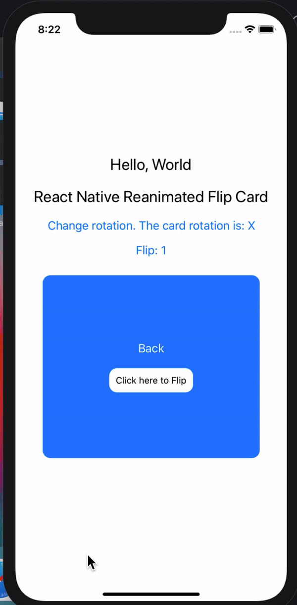
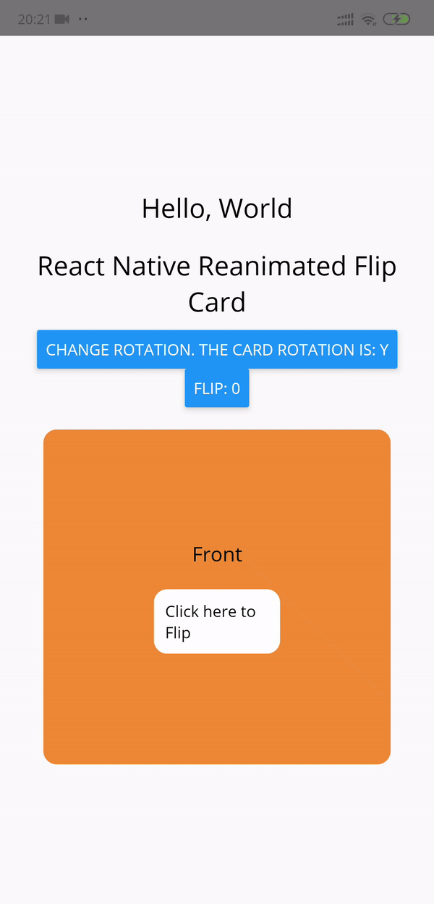

<div align="center">
  
[](https://www.npmjs.com/package/react-native-flip) [](https://www.npmjs.com/package/react-native-flip) [](https://www.npmjs.com/package/react-native-flip)
  
<h1>React Native Reanimated Flip Card</h1>


</div>

# Install

```sh
yarn add react-native-flip
# or
npm i react-native-flip
```

> :warning: You need to install [react-native-reanimated](https://docs.swmansion.com/react-native-reanimated/docs/next/installation/) and follow their installation instructions.

# Usage

```js
import FlipCard from "react-native-flip"

const make = () => {
  const Front = (
    <View
      style={{
        backgroundColor: "#ed8936",
        alignItems: "center",
        padding: 100,
        borderRadius: 12,
      }}
    >
      <Text style={{ fontSize: 18, color: "black" }}>Front</Text>
      <TouchableOpacity
        onPress={changeSide}
        style={{
          padding: 10,
          marginTop: 20,
          backgroundColor: "white",
          borderRadius: 12,
        }}
      >
        <Text>Click here to Flip</Text>
      </TouchableOpacity>
    </View>
  )
  const Back = (
    <View
      style={{
        backgroundColor: "#007AFF",
        alignItems: "center",
        padding: 100,
        borderRadius: 12,
      }}
    >
      <Text style={{ fontSize: 18, color: "white" }}>Back</Text>
      <TouchableOpacity
        onPress={changeSide}
        style={{
          padding: 10,
          marginTop: 20,
          backgroundColor: "white",
          borderRadius: 12,
        }}
      >
        <Text>Click here to Flip</Text>
      </TouchableOpacity>
    </View>
  )
  return (
    <SafeAreaView style={styles.container}>
      <Text style={styles.textStyle}>Hello, World</Text>
      <Text style={styles.textStyle}>React Native Reanimated Flip Card</Text>
      <Button
        title={`Change rotation. The card rotation is: ${rotate}`}
        onPress={() => {
          setRotate((rotation) => (rotation === "X" ? "Y" : "X"))
        }}
      />
      <Button title={`Flip: ${side}`} onPress={changeSide} />
      <FlipCard
        side={side}
        rotate={rotate}
        style={styles.flipContainer}
        front={Front}
        back={Back}
      />
    </SafeAreaView>
  )
}
```

## :wrench: Props

| Name        | Description                             | Required | Type          | Default |
| ----------- | --------------------------------------- | -------- | ------------- | ------- |
| perspective | Perspective of rotation                 | NO       | Number        | 1200    |
| side        | A value indicating Front(1) or Back(0)  | YES      | <1, 0>        | -       |
| rotate      | A value indicating the axis of rotation | NO       | <'Y', 'X'>    | #007AFF |
| style       | Container Style                         | NO       | ViewStyle     | #F2F5F7 |
| front       | React component in Front Side           | YES      | React.Element | -       |
| back        | React component in Back Side            | YES      | React.Element | -       |


## :camera: Screenhots

| iOS | Android |
|-----|---------|
|||

# Try it out

You can also try out the [example app](https://snack.expo.io/@pzatorski/react-native-flip-example) with Expo.

You can try the [React Native App](https://github.com/Karthik-B-06/react-native-reanimated-flip/tree/rn-example-with-better-readme/rn-example/RNFlip).

The source code for the example app is under [/examples](https://github.com/czystyl/react-native-reanimated-flip/tree/develop/examples) folder.
