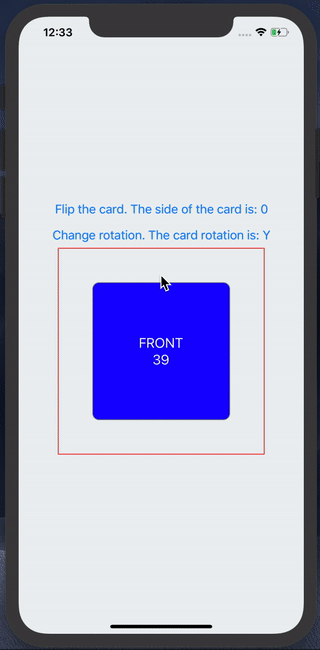

# REACT-NATIVE-REANIMATED-FLIP



# Install

```sh
    yarn add react-native-flip
```

# Usage

```js
import FlipCard from "react-native-flip"

const make = () => {
  return (
    <FlipCard
      side={0}
      front={<Text>Front component</Text>}
      back={<Text>Back component</Text>}
    />
  )
}
```

# Try it out

You can also try out the [example app](https://snack.expo.io/@pzatorski/react-native-flip-example) with Expo.

The source code for the example app is under [/examples](https://github.com/czystyl/react-native-reanimated-flip/tree/develop/examples) folder.
